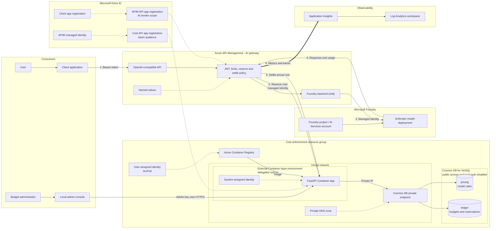

# Cost Enforcement API

This service reserves and settles a monthly, per-caller budget across model deployments. Money and rates use decimal USD strings with six-decimal precision. Prices distinguish uncached input, cache creation/write, cache read, and output tokens.

The USD ledger schema uses fields such as `limitUsd`, `spentUsd`, and `reservedUsd`. Existing documents using the former micro-USD fields must be migrated or removed before deploying this version.

## Azure architecture

The request path and the administrative path are intentionally separate. Callers authenticate with Microsoft Entra ID and can reach models only through Azure API Management (APIM). APIM uses its managed identity for both the Foundry model backend and the cost API. The local admin console uses a separate admin key and never sends that key to the browser.



The editable, presentation-sized source is in [`docs/azure-architecture.mmd`](docs/azure-architecture.mmd). The Bicep template provisions the cost-control resources. Entra registrations, APIM, the Foundry project/model deployment, Application Insights, and Log Analytics are prerequisites configured separately.

## Cosmos containers

- `ledger`, partitioned by `/partitionKey`: team policy documents use the `settings` partition; each user budget and its reservations use `user:<tenant-id>:<object-id>:YYYY-MM`. Budget checks and reservations therefore remain transactional per user.
- `pricing`, partitioned by `/deployment`: effective-dated model prices. Overlapping or missing active records fail closed.

A third container for "available budget" is intentionally not used. Available spend is derived as `limitUsd - spentUsd - reservedUsd` from the user-month budget document. Storing it separately would duplicate mutable financial state and prevent the budget update plus reservation from being one Cosmos transactional batch.

## API

- `POST /v1/reservations`: reserves a conservative maximum request cost.
- `POST /v1/reservations/{id}/settle`: atomically replaces reserved cost with actual cost.
- `POST /v1/reservations/{id}/release`: releases a failed request without charging it.
- `GET|PUT /v1/admin/budget/teams/{teamRole}`: reads or sets a team's per-user monthly allowance.
- `GET /v1/admin/budget/teams`: lists team policies for the admin UI.
- `GET /v1/admin/budget/metrics`: returns current-month team rollups and user-level allocated, spent, reserved, and remaining amounts.
- `GET /health`: unauthenticated liveness check.

All mutation endpoints require an Entra bearer token for `AUDIENCE` whose `azp` or `appid` equals `ALLOWED_CLIENT_ID`.

Admin routes under `/v1/admin/*` require `X-Admin-Key`. Keep this key server-side; the local console proxies admin requests so the browser never receives it.

## End-to-end Azure setup

Portal labels can change over time. Use the equivalent blade when the wording differs, and record every generated ID as you go instead of copying IDs from this repository.

### 1. Prerequisites

You need:

- An Azure subscription and resource group.
- Azure CLI with Bicep, Python 3.12 or later, and Git.
- Permission to create app registrations, deploy resources, assign RBAC, configure APIM, and deploy a Foundry model.
- An APIM Developer tier or higher. This deployment uses public APIM ingress; APIM Basic v2 is sufficient while the cost API remains a public, Entra-protected backend.
- A workspace-based Application Insights resource connected to a Log Analytics workspace.

Authenticate and select the intended subscription:

```powershell
az login
az account set --subscription '<subscription-id>'
az account show --query '{subscription:name, tenant:tenantId, user:user.name}' --output table
```

Set reusable values in the same PowerShell session:

```powershell
$subscriptionId = '<subscription-id>'
$tenantId = '<tenant-id>'
$resourceGroup = '<resource-group>'
$location = '<azure-region>'
$prefix = '<short-lowercase-prefix>'
$apimName = '<apim-service-name>'
$modelDeployment = '<anthropic-deployment-name>'
```

### 2. Deploy the Anthropic model in Microsoft Foundry

1. Open the Microsoft Foundry portal and select or create a project backed by an AI Services account.
2. Open **Model catalog**, filter by provider **Anthropic**, and select a model that is available in your region and subscription.
3. Review and accept the provider terms. Request or confirm quota when the deployment screen requires it.
4. Select **Deploy**, choose the deployment type and capacity, and give the deployment a stable alias. This alias is the `model` value callers send and the `deployment` key stored in the pricing catalog.
5. Record the Foundry endpoint, deployment alias, model/version, region, and deployment type.
6. Use the Foundry playground to make one small, non-streaming request. Do not continue until the direct model call succeeds and its response contains token usage.

Use provider documentation and your contract as the price authority. Do not infer rates from this repository's example data.

### 3. Create the Entra app registrations

This design uses two app registrations and one caller app. None requires a client secret for the deployed Azure-to-Azure path.

#### 3a. APIM gateway API registration

1. In **Microsoft Entra ID > App registrations**, select **New registration**.
2. Name it for the gateway API, choose **Accounts in this organizational directory only**, and leave the redirect URI empty.
3. Record its **Application (client) ID** as `$gatewayApiAppId`.
4. Open **Expose an API**, set the Application ID URI to `api://<gateway-api-app-id>`, and record it as `$gatewayAudience`.
5. Add a delegated scope named `AI.Invoke`. Allow admins and users to consent according to your tenant policy.
6. Under **App roles**, add each budget team as a `Users/Groups` role, such as `Team.Engineering`, `Team.SCM`, and `Team.Marketing`.
7. In the gateway API's **Enterprise application**, assign each user or security group to exactly one of those team roles.

The policy validates the audience and `AI.Invoke` scope, then requires exactly one configured team role. A user assigned to no team or multiple budget teams is denied because the charge target would be ambiguous.

#### 3b. Caller registration

1. Create another single-tenant registration for the test/client application.
2. Record its Application ID as `$clientAppId`.
3. Under **Authentication**, add a **Mobile and desktop applications** platform and enable public client flows when you plan to use interactive or device-code authentication.
4. Under **API permissions**, select **My APIs**, choose the gateway API registration, add delegated `AI.Invoke`, and grant admin consent when required by tenant policy.

Add this client ID to the APIM policy's approved client list. Create separate registrations for production applications instead of sharing the test client.

#### 3c. Cost API registration

1. Create a third single-tenant registration named for the cost enforcement API.
2. Record its Application ID as `$costApiAppId`.
3. Under **Expose an API**, set an Application ID URI such as `api://<cost-api-app-id>` and record the exact value as `$costApiAudience`.
4. Do not create a client secret. APIM obtains a token through its managed identity.

The same exact `$costApiAudience` must be used for the Bicep `audience` parameter and the APIM `cost-enforcement-app-id` named value. If your tenant issues the bare application ID as `aud`, use the bare ID consistently instead. A mismatch produces `401` from the cost API.

### 4. Deploy the cost-control data plane

The template creates:

- Azure Container Registry and an `AcrPull` user-assigned identity.
- An external, VNet-integrated Container Apps environment and Container App.
- Cosmos DB for NoSQL with `ledger` and `pricing` containers.
- A Cosmos private endpoint, private DNS zone, and VNet link.
- A Cosmos DB Built-in Data Contributor assignment for the Container App system identity.

Generate the admin key without printing or committing it:

```powershell
New-Item -ItemType Directory -Force .\cost-enforcement-api\.local | Out-Null
$adminKeyBytes = [System.Security.Cryptography.RandomNumberGenerator]::GetBytes(32)
$adminKey = [Convert]::ToBase64String($adminKeyBytes)
[System.IO.File]::WriteAllText(
	(Join-Path (Resolve-Path .\cost-enforcement-api\.local) 'admin-key'),
	$adminKey
)
```

Bootstrap the registry, build remotely with ACR Tasks, and deploy the app:

```powershell
$deployment = 'cost-enforcement'
$imageTag = 'v1'
$apimPrincipalId = az apim show `
	--name $apimName `
	--resource-group $resourceGroup `
	--query identity.principalId `
	--output tsv

# The API validates the managed identity's client/application ID, not its object ID.
$apimManagedIdentityClientId = az ad sp show `
	--id $apimPrincipalId `
	--query appId `
	--output tsv

az deployment group create `
	--name $deployment `
	--resource-group $resourceGroup `
	--template-file .\cost-enforcement-api\infra\main.bicep `
	--parameters namePrefix=$prefix `
				 audience=$costApiAudience `
				 apimManagedIdentityClientId=$apimManagedIdentityClientId `
				 deployContainerApp=false

$registry = az deployment group show `
	--name $deployment `
	--resource-group $resourceGroup `
	--query properties.outputs.registryName.value `
	--output tsv

az acr build `
	--registry $registry `
	--image "cost-enforcement-api:$imageTag" `
	.\cost-enforcement-api

az deployment group create `
	--name $deployment `
	--resource-group $resourceGroup `
	--template-file .\cost-enforcement-api\infra\main.bicep `
	--parameters namePrefix=$prefix `
				 audience=$costApiAudience `
				 apimManagedIdentityClientId=$apimManagedIdentityClientId `
				 imageTag=$imageTag `
				 deployContainerApp=true `
				 adminAuthDisabled=false `
				 adminApiKey=$adminKey

$costApiUrl = az deployment group show `
	--name $deployment `
	--resource-group $resourceGroup `
	--query properties.outputs.apiUrl.value `
	--output tsv
```

For a system-assigned APIM identity, `identity.principalId` is the enterprise application's object ID. The `az ad sp show` lookup resolves its client/application ID, which is the value expected by `ALLOWED_CLIENT_ID`. If APIM uses a user-assigned identity, use that identity's `clientId` and select that identity explicitly in the APIM managed-identity policies.

Validate the deployment:

```powershell
Invoke-RestMethod "$costApiUrl/health"
az containerapp show --name "$prefix-vnet-api" --resource-group $resourceGroup `
	--query '{fqdn:properties.configuration.ingress.fqdn, revision:properties.latestReadyRevisionName}'
```

Cosmos public network access and local authentication remain disabled. Seed through the admin API or from an authorized private-network workload, not by weakening Cosmos networking.

### 5. Configure APIM identity and the Foundry backend

1. In the APIM service, open **Managed identities** and enable the identity that the policy will use.
2. On the Foundry resource or project scope, grant that identity the least-privilege inference role required by the selected deployment, typically **Cognitive Services OpenAI User** for model inference. Do not grant Owner or Contributor for runtime calls.
3. In APIM, select **APIs > + Add API > Microsoft Foundry**.
4. Select the Foundry resource containing the Anthropic deployment, choose **Azure OpenAI v1** client compatibility, provide a display name and base path, and create the API.
5. The import creates operations, a backend entity, and managed-identity authentication. Open the generated backend and record its backend ID.
6. In [`../policy.xml`](../policy.xml), replace both `backend-id="global-policy-foundry-demo-ai-endpoint"` values when your generated backend ID differs.
7. Confirm the policy uses `<authentication-managed-identity resource="https://ai.azure.com" />` before forwarding to Foundry.

Use the imported operation's **Test** tab to confirm the exact URL. APIM portal-generated paths can evolve; common OpenAI v1 operations are `/openai/v1/chat/completions` and `/openai/v1/responses`.

### 6. Add APIM named values and apply the policy

Create these named values under **APIM > Named values**. Mark secrets as secret; the values below are identifiers, role names, or URLs, not credentials.

| Name | Value |
| --- | --- |
| `entra-tenant-id` | Entra tenant ID |
| `approved-client-app-id` | Caller registration Application ID |
| `apim-api-app-id` | Gateway API registration Application ID |
| `cost-enforcement-url` | `$costApiUrl` without a trailing slash |
| `cost-enforcement-app-id` | Exact `$costApiAudience` requested by APIM managed identity |
| `team-app-roles` | Comma-separated role values, for example `Team.Engineering,Team.SCM,Team.Marketing` |

Then:

1. Open the imported API, select **All operations > Policies**, and preserve a copy of the generated policy.
2. Merge or replace it with [`../policy.xml`](../policy.xml).
3. Keep the generated Foundry backend ID and managed-identity authentication aligned with Step 5.
4. Save and use **Calculate effective policy** to confirm no product or global policy unexpectedly overrides this API.

The supplied policy resolves exactly one allowed team role and constructs both `callerKey` and `userKey` as `user:<tenant-id>:<object-id>`. The cost API uses `teamRole` to load the per-user allowance, then reserves against that user's independent monthly partition. Email and display name remain attribution fields rather than budget keys.

The request decision is:

1. APIM validates tenant, audience, approved client, and delegated `AI.Invoke` scope.
2. APIM resolves exactly one role listed in the `team-app-roles` named value.
3. APIM sends the immutable user key, resolved team role, deployment, and request body to the cost API.
4. The cost API loads the team policy. A missing policy fails closed with `403`.
5. The cost API estimates worst-case cost and atomically compares it with that user's `limitUsd - spentUsd - reservedUsd`.
6. APIM calls Foundry only when the reservation succeeds, then settles actual usage against the same user reservation.

### 7. Configure Application Insights and Log Analytics

The FinOps dashboard reads the APIM Application Insights integration. This keeps high-volume analytical telemetry out of the transactional Cosmos ledger. Policy metadata comes from `traces`, and request latency is correlated from `requests` by operation ID.

Two manual configurations are required:

1. Create or select a workspace-based Application Insights resource linked to the intended Log Analytics workspace.
2. Create an APIM Application Insights logger and enable it on the imported API at 100% sampling with verbosity **Information** or lower. The policy's `<trace source="llm-usage">` metadata is written to `traces.customDimensions`.

Do not log bearer tokens, prompts, responses, admin keys, or other secrets. These APIM changes are intentionally manual; repository automation does not modify gateway diagnostics. APIM resource logs remain an optional fallback when `LOG_ANALYTICS_WORKSPACE_ID` is configured without an Application Insights resource ID.

Verify telemetry after a test call:

```kusto
traces
| where timestamp > ago(30m)
| where message == "llm-request"
| project timestamp, operation_Id, customDimensions
| order by timestamp desc
```

### 8. Add model prices and budgets

Start the local administration console from the repository root:

```powershell
python -m pip install -r .\cost-enforcement-api\requirements-dev.txt
$env:COST_ENFORCEMENT_URL = $costApiUrl
$env:ADMIN_API_KEY = [System.IO.File]::ReadAllText(
	(Resolve-Path .\cost-enforcement-api\.local\admin-key)
).Trim()
$env:APPLICATION_INSIGHTS_RESOURCE_ID = az monitor app-insights component show `
	--resource-group '<monitoring-resource-group>' `
	--app '<application-insights-name>' `
	--query id `
	--output tsv
Set-Location .\cost-enforcement-api
python -m uvicorn local_simulator:app --host 127.0.0.1 --port 8010
```

Open `http://127.0.0.1:8010` and confirm the header says **Real enforcement**.

1. Add a rate card whose deployment name exactly matches the Foundry deployment alias.
2. Enter authoritative uncached input, cache-write, cache-read, and output rates per million tokens.
3. Set the provider's maximum output-token value; this controls worst-case reservation size.
4. In **Budget policy**, enter the exact Entra app-role value and its per-user monthly allowance.
5. Save the policy. No member list or member count is required; APIM resolves the caller's role and the cost API creates that user's monthly ledger lazily on the first request.

For example:

```powershell
$headers = @{ 'X-Admin-Key' = $env:ADMIN_API_KEY }
$body = @{ perUserLimitUsd = '10.00' } | ConvertTo-Json
Invoke-RestMethod `
	-Method Put `
	-Uri "$costApiUrl/v1/admin/budget/teams/Team.Engineering" `
	-Headers $headers `
	-ContentType 'application/json' `
	-Body $body
```

For reporting, the APIM `llm-usage` trace emits `teamRole`, immutable `userKey`, token usage, settled `actualUsd`, and `remainingBudgetUsd` to Azure Monitor. Reporting does not participate in enforcement.

The admin key remains in the Python server process. Never put it in JavaScript, source control, screenshots, or APIM named values.

### 9. Test from the APIM portal

Acquire a delegated token for the caller registration. One PowerShell option is the community `MSAL.PS` module:

```powershell
Install-Module MSAL.PS -Scope CurrentUser
$gatewayAudience = 'api://<gateway-api-app-id>'
$token = Get-MsalToken `
	-TenantId $tenantId `
	-ClientId '<caller-application-id>' `
	-Scopes "$gatewayAudience/AI.Invoke" `
	-Interactive
```

In **APIM > APIs > your imported API > Test**:

1. Select the non-streaming Chat Completions or Responses operation supported by the deployment.
2. Add `Authorization: Bearer <access-token>` and `Content-Type: application/json`.
3. Use the exact deployment alias in `model`.
4. Select **Trace** and send the request.

Chat Completions example:

```json
{
  "model": "<anthropic-deployment-name>",
  "stream": false,
  "max_tokens": 64,
  "messages": [
	{"role": "user", "content": "Reply with one sentence."}
  ]
}
```

Expected checks:

| Scenario | Expected result |
| --- | --- |
| Valid caller, known price, sufficient budget | `200`; response includes model output and usage |
| Missing or invalid caller token | `401` |
| Token lacks `AI.Invoke`, approved client, user identity, or an allowed team role | `401` or `403` depending on the failed validation stage |
| Token contains multiple configured team roles | `403 ambiguous_team_role` |
| Unknown deployment or missing active price | Request fails closed before inference |
| Monthly budget cannot cover the reservation | `403 cost_budget_exceeded` |
| Token/call allocation exceeded | `429` |
| Cost API unavailable | `503 cost_enforcement_unavailable` |

For the budget test, lower only the test team's allocation below the displayed worst-case reservation, make one call, confirm `403`, and restore the intended allocation. Check the APIM trace, Container App logs, Cosmos ledger, and `AppTraces` after the successful call.

### 10. Production checklist

- Replace every sample price with a reviewed provider/contract rate and verification date.
- Use separate app registrations for test and production callers.
- Prefer immutable object IDs over mutable email addresses for durable budget ownership.
- Keep Cosmos public access and local authentication disabled.
- Store admin secrets in Key Vault or another managed secret workflow for production administration.
- Restrict direct Foundry access so governed callers cannot bypass APIM.
- Configure alerting for cost API failures, unpriced deployments, budget denials, and missing usage telemetry.
- Review APIM trace data retention and personal-data access controls.
- Run load and concurrency tests before treating reservation accounting as a production financial control.

## Run locally

Set `COSMOS_ENDPOINT`. For local-only testing, set `AUTH_DISABLED=true`; never use that setting in Azure.

```powershell
python -m pip install -r requirements-dev.txt
python -m pytest -q
python main.py
```

Seed reviewed prices using an identity with Cosmos data-plane contributor access:

```powershell
$env:COSMOS_ENDPOINT = "https://<account>.documents.azure.com:443/"
python scripts/seed_prices.py prices.example.json
```

## Budget admin console

Without configuration, the workbench runs as a local simulator. To administer the deployed Cosmos-backed ledger, configure the cost API URL and the same admin key stored in the Container App, then start it locally:

```powershell
python -m pip install -r .\cost-enforcement-api\requirements-dev.txt
$env:COST_ENFORCEMENT_URL = 'https://<cost-api>.<region>.azurecontainerapps.io'
$env:ADMIN_API_KEY = [System.IO.File]::ReadAllText(
	(Resolve-Path .\cost-enforcement-api\.local\admin-key)
).Trim()
$env:APPLICATION_INSIGHTS_RESOURCE_ID = '<application-insights-resource-id>'
Set-Location .\cost-enforcement-api
python -m uvicorn local_simulator:app --host 127.0.0.1 --port 8010
```

Open `http://127.0.0.1:8010` and verify the header says **Real enforcement**. The live budget panel manages team policies, not individual overrides. Every user assigned to a role receives that role's allowance in a separate monthly ledger; one member exhausting their allowance does not consume another member's allowance.

Use the **Budget metrics** view for the current-month team rollup and user detail. Team allocation is the sum of instantiated user ledgers, and active users are callers who have invoked through APIM during the month. The view does not synchronize or infer total Entra role membership.

Use the **FinOps dashboard** for time-series and dimensional analysis from APIM telemetry. Its nested views cover spend velocity, team/application allocation, model token mix, latency distribution, errors, cache efficiency, and user-level consumption. An empty or inaccessible workspace is shown as a telemetry status, not as authoritative zero usage. The signed-in local identity needs Log Analytics Reader access to the workspace.

Do not give the global admin key to team owners. Expose team reports through an Entra-authenticated dashboard that authorizes an owner only for their team.
