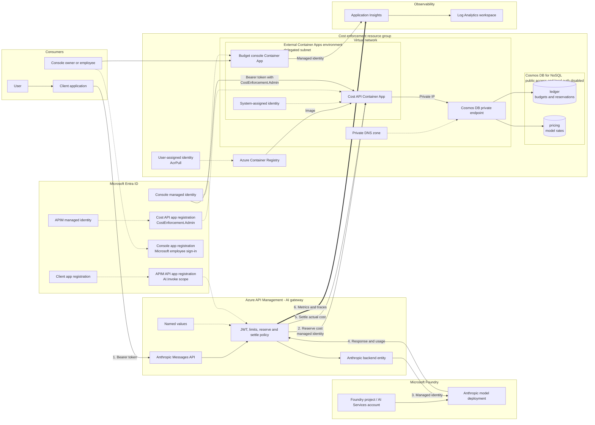

# Cost Enforcement API

This service reserves and settles a monthly, per-caller budget across model deployments. Money and rates use decimal USD strings with six-decimal precision. Prices distinguish uncached input, cache creation/write, cache read, and output tokens.

The USD ledger schema uses fields such as `limitUsd`, `spentUsd`, and `reservedUsd`. Existing documents using the former micro-USD fields must be migrated or removed before deploying this version.

## Azure architecture

The request path and the administrative path are intentionally separate. Callers authenticate with Microsoft Entra ID and can reach models only through Azure API Management (APIM). APIM uses its managed identity for both the Foundry model backend and the cost API. A second Container App hosts the Budget console and uses its managed identity to administer the cost API and query Application Insights. Employees authenticate through Entra and self-provision as members; a separately configured local credential is the console owner.



The editable, presentation-sized source is in [`docs/azure-architecture.mmd`](docs/azure-architecture.mmd). The Bicep template provisions the cost-control resources and both Container Apps. The deployment script creates or reuses the cost API and console registrations. APIM, the Foundry deployment, and Application Insights remain configurable prerequisites.

## Cosmos containers

- `ledger`, partitioned by `/partitionKey`: team policy documents use the `settings` partition; each user budget and its reservations use `user:<tenant-id>:<object-id>:YYYY-MM`. Budget checks and reservations therefore remain transactional per user.
- `pricing`, partitioned by `/deployment`: effective-dated model prices. Overlapping or missing active records fail closed.

A third container for "available budget" is intentionally not used. Available spend is derived as `limitUsd - spentUsd - reservedUsd` from the user-month budget document. Storing it separately would duplicate mutable financial state and prevent the budget update plus reservation from being one Cosmos transactional batch.

## API

- `POST /v1/reservations`: reserves a conservative maximum request cost.
- `POST /v1/reservations/{id}/settle`: atomically replaces reserved cost with actual cost.
- `POST /v1/reservations/{id}/release`: releases a failed request without charging it.
- `GET|PUT /v1/admin/budget/teams/{teamRole}`: reads or sets a team's per-user monthly allowance.
- `GET /v1/admin/budget/teams`: lists team policies for the admin UI.
- `GET /v1/admin/budget/metrics`: returns current-month team rollups and user-level allocated, spent, reserved, and remaining amounts.
- `GET /health`: unauthenticated liveness check.

Enforcement routes require an Entra bearer token for `AUDIENCE` whose `azp` or `appid` equals the APIM managed identity client ID in `ALLOWED_CLIENT_ID`.

Admin routes under `/v1/admin/*` require the `CostEnforcement.Admin` application role and the exact console managed-identity object ID in `ADMIN_ALLOWED_PRINCIPAL_ID`. There is no production shared admin key.

## End-to-end Azure setup

Portal labels can change over time. Use the equivalent blade when the wording differs, and record every generated ID as you go instead of copying IDs from this repository.

### 1. Prerequisites

You need:

- An Azure subscription and resource group.
- Azure CLI with Bicep, Python 3.12 or later, and Git.
- Permission to create app registrations, deploy resources, assign RBAC, configure APIM, and deploy a Foundry model. The exact roles are listed below.
- An APIM Developer tier or higher. This deployment uses public APIM ingress; APIM Basic v2 is sufficient while the cost API remains a public, Entra-protected backend.
- A workspace-based Application Insights resource connected to a Log Analytics workspace.

Authenticate and select the intended subscription:

```powershell
az login
az account set --subscription '<subscription-id>'
az account show --query '{subscription:name, tenant:tenantId, user:user.name}' --output table
```

Set reusable values in the same PowerShell session:

```powershell
$subscriptionId = '<subscription-id>'
$tenantId = '<tenant-id>'
$resourceGroup = '<resource-group>'
$location = '<azure-region>'
$prefix = '<short-lowercase-prefix>'
$apimName = '<apim-service-name>'
$modelDeployment = '<anthropic-deployment-name>'
```

### 2. Deploy the Anthropic model in Microsoft Foundry

1. Open the Microsoft Foundry portal and select or create a project backed by an AI Services account.
2. Open **Model catalog**, filter by provider **Anthropic**, and select a model that is available in your region and subscription.
3. Review and accept the provider terms. Request or confirm quota when the deployment screen requires it.
4. Select **Deploy**, choose the deployment type and capacity, and give the deployment a stable alias. This alias is the `model` value callers send and the `deployment` key stored in the pricing catalog.
5. Record the Foundry endpoint, deployment alias, model/version, region, and deployment type.
6. Use the Foundry playground to make one small, non-streaming request. Do not continue until the direct model call succeeds and its response contains token usage.

Use provider documentation and your contract as the price authority. Do not infer rates from this repository's example data.

### 3. Create the Entra app registrations

This design uses a gateway registration, one or more caller registrations, a cost API registration, and a console registration. Only the console web registration has a client secret; the deployment script creates it and passes it as a secure Bicep parameter. Runtime service-to-service access uses managed identities.

#### 3a. APIM gateway API registration

1. In **Microsoft Entra ID > App registrations**, select **New registration**.
2. Name it for the gateway API, choose **Accounts in this organizational directory only**, and leave the redirect URI empty.
3. Record its **Application (client) ID** as `$gatewayApiAppId`.
4. Open **Expose an API**, set the Application ID URI to `api://<gateway-api-app-id>`, and record it as `$gatewayAudience`.
5. Add a delegated scope named `AI.Invoke`. Allow admins and users to consent according to your tenant policy.
6. Under **App roles**, add each budget team as a `Users/Groups` role, such as `Team.Engineering`, `Team.SCM`, and `Team.Marketing`.
7. In the gateway API's **Enterprise application**, assign each user or security group to exactly one of those team roles.

The policy validates the audience and `AI.Invoke` scope, then requires exactly one configured team role. A user assigned to no team or multiple budget teams is denied because the charge target would be ambiguous.

#### 3b. Caller registration

1. Create another single-tenant registration for the test/client application.
2. Record its Application ID as `$clientAppId`.
3. Under **Authentication**, add a **Mobile and desktop applications** platform and enable public client flows when you plan to use interactive or device-code authentication.
4. Under **API permissions**, select **My APIs**, choose the gateway API registration, add delegated `AI.Invoke`, and grant admin consent when required by tenant policy.

Add this client ID to the APIM policy's approved client list. Create separate registrations for production applications instead of sharing the test client.

#### 3c. Cost API registration

1. Create a third single-tenant registration named for the cost enforcement API.
2. Record its Application ID as `$costApiAppId`.
3. Under **Expose an API**, set an Application ID URI such as `api://<cost-api-app-id>` and record the exact value as `$costApiAudience`.
4. Add an application role with value `CostEnforcement.Admin`, display name **Cost Enforcement Administrator**, and allowed member type **Applications**.
5. Do not create a client secret. APIM and the console obtain tokens through managed identity.

The cost API validates the bare application ID as its token audience. APIM requests `api://<cost-api-app-id>/.default`; a mismatch produces `401` from the cost API. The deployment script creates this registration when `CostApiApplicationClientId` is empty and assigns `CostEnforcement.Admin` to the console identity.

#### 3d. Budget console registration

1. Create a single-tenant registration named **Cost Budget Console**. Guest employees must exist in this resource tenant.
2. Leave **Assignment required** set to **No** on the enterprise application.
3. Add the exact `https://<console-fqdn>` origin as a **Single-page application** redirect URI. Add `http://localhost:8010` for local Microsoft sign-in.
4. Leave both **Implicit grant and hybrid flows** token options disabled. MSAL Browser uses the authorization-code flow with PKCE.
5. Do not create a client credential. A browser public client cannot keep a secret.

The deployment script performs these steps. The browser uses the resource tenant authority and a full-page MSAL redirect, then posts the returned ID token to the backend. The backend verifies the Microsoft signature, client audience, tenant-derived issuer, expiration, and exact configured email domain before creating a `member` session. Members can view Budget metrics and FinOps reports. The local `owner` account can also use Management and change budgets and prices. Both identities receive an eight-hour signed, HTTP-only, Secure, SameSite=Lax application session. The owner password is stored only as a PBKDF2-SHA256 hash.

Container Apps authentication (EasyAuth) and its token store remain disabled so the application-owned MSAL Browser flow is the only interactive authentication layer.

### 4. Deploy the cost-control data plane

The template and deployment script create:

- Azure Container Registry and an `AcrPull` user-assigned identity.
- An external, VNet-integrated Container Apps environment, cost API, and Budget console.
- Cosmos DB for NoSQL with `ledger` and `pricing` containers.
- A Cosmos private endpoint, private DNS zone, and VNet link.
- Cosmos DB Built-in Data Contributor for the cost API identity.
- Monitoring Reader on the selected Application Insights component for the console identity.
- Application-owned Entra sign-in and the managed-identity app-role assignment.

For a fresh deployment, run this from the repository root. Empty application IDs tell the script to create registrations; supplying IDs reuses them.

```powershell
.\cost-enforcement-api\scripts\Deploy-FinOpsConsole.ps1 `
	-SubscriptionId '<subscription-id>' `
	-ResourceGroup '<resource-group>' `
	-Location '<azure-region>' `
	-NamePrefix '<lowercase-prefix>' `
	-ApplicationInsightsResourceId '<full-application-insights-resource-id>' `
	-ApimManagedIdentityClientId '' `
	-ApimName '<apim-name>' `
	-ApimResourceGroup '<apim-resource-group>' `
	-CostApiApplicationClientId '' `
	-ConsoleApplicationClientId '' `
	-ConsoleAllowedEmailDomains @('<employee-domain>') `
	-ConsoleOwnerUsername '<owner-username>'
```

The script securely prompts for the owner's password unless `CONSOLE_OWNER_PASSWORD` is already set in the process environment. It selects the subscription, creates the resource group if needed, creates or reuses both registrations, configures the console for self-service employee sign-in, creates the console credential, bootstraps ACR, builds both images with ACR Tasks, deploys both apps, adds the MSAL callback URI, and assigns the console managed identity to the cost API role. It does not rewrite the APIM policy or deploy a Foundry model.

Key configuration inputs:

| Input | Purpose |
| --- | --- |
| `SubscriptionId`, `ResourceGroup`, `Location`, `NamePrefix` | Deployment scope and naming |
| `ApplicationInsightsResourceId` | Full component resource ID; it may be in another resource group |
| `ApimManagedIdentityClientId` | APIM user/system identity application ID; alternatively use `ApimName` and `ApimResourceGroup` |
| `CostApiApplicationClientId`, `ConsoleApplicationClientId` | Existing registration IDs; empty values create or discover by display name |
| `ContainerRegistryName`, `CosmosAccountName` | Optional globally unique names instead of generated names |
| `ContainerAppsEnvironmentName`, `VirtualNetworkName`, `CostApiName`, `ConsoleAppName` | Optional deterministic resource names |
| `CostApiImageRepository`, `ConsoleImageRepository`, `ImageTag` | Image coordinates |
| `ConsoleAllowedEmailDomains` | Exact employee email domains that self-provision as members |
| `ConsoleOwnerUsername` | Local owner username; defaults to the interactive Azure user's UPN |

For noninteractive deployment, set `CONSOLE_OWNER_PASSWORD` only in the deployment process environment and clear it afterward. Interactive deployment uses a masked secure prompt. The password must contain at least 12 characters.

The deploying identity needs **Contributor** plus **Role Based Access Control Administrator** on the deployment resource group and permission to assign **Monitoring Reader** at the Application Insights scope. For interactive Entra administration, use **Application Administrator** or **Cloud Application Administrator**. A deployment service principal instead needs Microsoft Graph application permissions `Application.ReadWrite.All`, `AppRoleAssignment.ReadWrite.All`, and `Directory.Read.All`, with tenant admin consent.

Runtime authorization is intentionally narrower:

| Identity | Permission | Scope |
| --- | --- | --- |
| Cost API system identity | Cosmos DB Built-in Data Contributor | Cosmos account |
| ACR pull user identity | AcrPull | Registry |
| Console system identity | Monitoring Reader | Application Insights component |
| Console system identity | `CostEnforcement.Admin` app role | Cost API enterprise application |
| Local owner | Backend `owner` role | Budget console |
| Allowed-domain employee | Backend `member` role | Budget console |
| APIM managed identity | Client-ID allowlist | Cost API middleware |

Validate the deployment URLs returned by the script:

```powershell
Invoke-RestMethod "$costApiUrl/health"
Invoke-WebRequest "$consoleUrl/health"
```

Cosmos public network access and local authentication remain disabled. Seed through the admin API or from an authorized private-network workload, not by weakening Cosmos networking.

### 5. Configure APIM identity and the Anthropic backend

The Microsoft Foundry import wizard creates OpenAI-compatible operations. This sample instead exposes the native Anthropic Messages API, so create the backend, API, and operations manually. Microsoft documents the Foundry Anthropic base URL as `https://<resource-name>.services.ai.azure.com/anthropic` and the Messages target URI as `/v1/messages`.

1. In the APIM service, open **Managed identities** and enable the system-assigned identity, or attach the user-assigned identity that the policy will use.
2. On the Foundry resource scope, grant that identity **Cognitive Services User**. This is the runtime inference role; do not grant Owner or Contributor.
3. In APIM, open **APIs > Backends > + Create new backend** and configure:
   - **Name**: a stable name such as `anthropic-foundry`
   - **Backend hosting type**: **Custom URL**
   - **Runtime URL**: `https://<resource-name>.services.ai.azure.com/anthropic`
   - **Authorization credentials**: leave unset because [`policy.xml`](policy.xml) obtains and forwards the managed-identity bearer token
4. Create the backend and record its backend ID. Set the APIM named value `backend-id` to this exact ID.
5. Open **APIs > + Add API > HTTP** and create a blank API:
   - **Display name**: `Anthropic Messages API`
   - **Name**: a stable identifier such as `anthropic-messages`
   - **Web service URL**: `https://<resource-name>.services.ai.azure.com/anthropic`
   - **API URL suffix**: choose a client-facing suffix such as `anthropic`
6. On the new API's **Design** tab, select **+ Add operation** and add both native Anthropic operations:

   | Display name | Method | URL |
   | --- | --- | --- |
   | Create message | `POST` | `/v1/messages` |
   | Count message tokens | `POST` | `/v1/messages/count_tokens` |

7. Apply [`policy.xml`](policy.xml) at the API's **All operations** scope. Confirm its inbound section contains these policies in this order before the request is forwarded:

   ```xml
   <authentication-managed-identity resource="https://ai.azure.com" />
   <set-backend-service backend-id="{{backend-id}}" />
   ```

   For a user-assigned identity, add its client ID to the authentication policy: `client-id="<managed-identity-client-id>"`.
8. In the **Test** tab, call **Create message** with `Content-Type: application/json`, `anthropic-version: 2023-06-01`, and a body whose `model` is the Foundry deployment alias:

   ```json
   {
     "model": "<anthropic-deployment-name>",
     "max_tokens": 64,
     "messages": [
       {
         "role": "user",
         "content": "Reply with one short sentence."
       }
     ]
   }
   ```

   A successful response must contain an Anthropic message object and a `usage` object. Also test **Count message tokens**; the supplied policy deliberately bypasses budget reservation and generation telemetry for that operation.

References: [Deploy and use Claude models in Microsoft Foundry](https://learn.microsoft.com/azure/foundry/foundry-models/how-to/use-foundry-models-claude), [Manually add an API in APIM](https://learn.microsoft.com/azure/api-management/add-api-manually), [APIM backends](https://learn.microsoft.com/azure/api-management/backends), and [managed-identity authentication policy](https://learn.microsoft.com/azure/api-management/authentication-managed-identity-policy).

### 6. Add APIM named values and apply the policy

Create these named values under **APIM > Named values**. Mark secrets as secret; the values below are identifiers, role names, or URLs, not credentials.

| Name | Value |
| --- | --- |
| `entra-tenant-id` | Entra tenant ID |
| `approved-client-app-id` | Caller registration Application ID |
| `apim-api-app-id` | Gateway API registration Application ID |
| `cost-enforcement-url` | `$costApiUrl` without a trailing slash |
| `cost-enforcement-app-id` | Exact `$costApiAudience` requested by APIM managed identity |
| `team-app-roles` | Comma-separated role values, for example `Team.Engineering,Team.SCM,Team.Marketing` |

Then:

1. Open the manually created Anthropic API and select **All operations > Policies**.
2. Merge or replace it with [`policy.xml`](policy.xml).
3. Keep the Anthropic backend ID and managed-identity authentication aligned with Step 5.
4. Save and use **Calculate effective policy** to confirm no product or global policy unexpectedly overrides this API.

The supplied policy resolves exactly one allowed team role and constructs both `callerKey` and `userKey` as `user:<tenant-id>:<object-id>`. The cost API uses `teamRole` to load the per-user allowance, then reserves against that user's independent monthly partition. Email and display name remain attribution fields rather than budget keys.

The request decision is:

1. APIM validates tenant, audience, approved client, and delegated `AI.Invoke` scope.
2. APIM resolves exactly one role listed in the `team-app-roles` named value.
3. APIM sends the immutable user key, resolved team role, deployment, and request body to the cost API.
4. The cost API loads the team policy. A missing policy fails closed with `403`.
5. The cost API estimates worst-case cost and atomically compares it with that user's `limitUsd - spentUsd - reservedUsd`.
6. APIM calls Foundry only when the reservation succeeds, then settles actual usage against the same user reservation.

### 7. Configure Application Insights and Log Analytics

The FinOps dashboard reads the APIM Application Insights integration. This keeps high-volume analytical telemetry out of the transactional Cosmos ledger. Policy metadata comes from `traces`, and request latency is correlated from `requests` by operation ID.

The query accepts both plain metadata keys and APIM's `prop__`-prefixed custom dimensions. Duplicate trace ingestion is deduplicated by gateway correlation ID, not by user or chat turn. Cowork can legitimately make multiple model calls per turn (tool loops, retries, and background work); distinct correlation IDs remain distinct requests. The `/messages/count_tokens` operation is not generation and bypasses inference reservations, token/call counters, and `llm-request` telemetry.

Application allocation uses the delegated token's `azp`/`appid` (the Entra client application), not a conversation ID or the APIM backend ID. User rows are grouped by user, team, and application, so one user's activity in multiple applications is not assigned to their most recent app.

The cost API returns and persists `spendBreakdown` for uncached input, output, cache write, and cache read using its selected rate card. Deploy the cost API before applying the updated policy, then deploy the console. Historical records without category costs remain in **Unallocated / rounding**; the console does not invent rates or backfill missing token usage. A sub-microdollar difference between category totals and `actualUsd` is the existing upward settlement rounding.

The existing Azure deployment was updated on 2026-09-30: `dev-vnet-api` and `dev-budget-console` run digest-pinned `--acct0930v1` revisions, and the console identifies release `2026-09-30.1`. The attempted live `agent-ai-gateway/claude-anthropic` accounting update was rolled back after unresolved streaming costs produced empty trace metadata and APIM returned HTTP 500 `ExpressionValueValidationFailure`. The saved pre-update gateway policy is live; the application revisions remain deployed. The corrected local policy emits explicit `unavailable` / `not_called` sentinels instead of empty trace values, but must pass a real streaming-call check before it is redeployed. The deployment does not reconcile historical records or make streaming usage available.

**Streaming limitation:** this policy settles JSON responses only. It does not consume or buffer SSE to extract usage. Claude's `message_start` and final `message_delta` carry the streaming token buckets, which cannot be reliably read in an ordinary APIM outbound JSON expression. Streaming requests retain their worst-case reservation and emit `streaming_unsettled`; the console explicitly counts unresolved requests rather than reporting a confirmed zero charge. To obtain exact Cowork streaming cost, use a streaming-aware proxy that forwards events and settles the final cumulative usage, or deliberately choose a buffered/non-streaming path. Do not release unresolved reservations as if they were free. Existing incorrectly zero-settled requests require reconciliation from independently retained usage; these changes cannot recover absent data.

Two manual configurations are required:

1. Create or select a workspace-based Application Insights resource linked to the intended Log Analytics workspace.
2. Create an APIM Application Insights logger and enable it on the Anthropic API at 100% sampling with verbosity **Information** or lower. The policy's `<trace source="llm-usage">` metadata is written to `traces.customDimensions`.

Do not log bearer tokens, prompts, responses, credentials, or other secrets. These APIM changes are intentionally manual; repository automation does not modify gateway diagnostics. APIM resource logs remain an optional fallback when `LOG_ANALYTICS_WORKSPACE_ID` is configured without an Application Insights resource ID.

Verify telemetry after a test call:

```kusto
traces
| where timestamp > ago(30m)
| where message == "llm-request"
| project timestamp, operation_Id, customDimensions
| order by timestamp desc
```

#### Diagnosing rate limits without raising the wrong threshold

- The API policy still allows **10,000,000 app TPM** and **50,000,000 user TPM**. Those are gateway limits, not Foundry/Anthropic deployment limits. The app limit is shared by everyone using the same approved client.
- Claude support in `llm-token-limit` and `llm-emit-token-metric` currently requires an APIM **v2 tier**. Confirm the API schema is Anthropic Messages; an OpenAI-only import is not interchangeable with `/anthropic/v1/messages`.
- Capture the status, `Retry-After`, `x-correlation-id`, `x-rate-limit-source`, `x-tokens-remaining-app`, and `x-tokens-remaining-user` from a failed request, with credentials removed. `backend` identifies a downstream 429; `apim:<policy-id>` identifies this policy's app/user limiter. Limits inherited through `<base />` still need inspection using **Calculate effective policy**.
- The previous "fallback" retried the same backend immediately. It is removed; the backend's `Retry-After` is preserved for the client.
- Token counters now use distinct, tenant-qualified app/user keys. Changing keys starts new gateway counter buckets during rollout; the Cosmos monthly budget is unchanged. Native streaming token policies estimate tokens even when prompt estimation is disabled, so changing only `estimate-prompt-tokens` is not a streaming fix.
- Call quotas renew every **2,592,000 seconds (30 days)**, not the previous 25,920,000 seconds (300 days). This is a fixed-period call quota, separate from the calendar-month USD budget.
- `x-cost-settlement-state` and the `cost-settlement-unresolved` error trace expose missing usage and failed settlement. A downstream rejected request with no usage releases its reservation; a successful response with missing usage keeps it reserved.

Relevant platform references: [LLM token-limit supported schemas and estimation](https://learn.microsoft.com/azure/api-management/llm-token-limit-policy), [LLM token metrics](https://learn.microsoft.com/azure/api-management/llm-emit-token-metric-policy), and [Claude APIs in Foundry](https://learn.microsoft.com/azure/foundry/foundry-models/concepts/claude-models).

### 8. Add model prices and budgets

Open the deployed console URL and sign in with the configured owner username and password.

1. Add a rate card whose deployment name exactly matches the Foundry deployment alias.
2. Enter authoritative uncached input, cache-write, cache-read, and output rates per million tokens.
3. Set the provider's maximum output-token value; this controls worst-case reservation size.
4. In **Budget policy**, enter the exact Entra app-role value and its per-user monthly allowance.
5. Save the policy. No member list or member count is required; APIM resolves the caller's role and the cost API creates that user's monthly ledger lazily on the first request.

For reporting, the APIM `llm-usage` trace emits `teamRole`, immutable `userKey`, token usage, settled `actualUsd`, and `remainingBudgetUsd` to Azure Monitor. Reporting does not participate in enforcement.

### 9. Test from the APIM portal

Acquire a delegated token for the caller registration. One PowerShell option is the community `MSAL.PS` module:

```powershell
Install-Module MSAL.PS -Scope CurrentUser
$gatewayAudience = 'api://<gateway-api-app-id>'
$token = Get-MsalToken `
	-TenantId $tenantId `
	-ClientId '<caller-application-id>' `
	-Scopes "$gatewayAudience/AI.Invoke" `
	-Interactive
```

In **APIM > APIs > your Anthropic API > Test**:

1. Select the non-streaming Chat Completions or Responses operation supported by the deployment.
2. Add `Authorization: Bearer <access-token>` and `Content-Type: application/json`.
3. Use the exact deployment alias in `model`.
4. Select **Trace** and send the request.

Chat Completions example:

```json
{
  "model": "<anthropic-deployment-name>",
  "stream": false,
  "max_tokens": 64,
  "messages": [
	{"role": "user", "content": "Reply with one sentence."}
  ]
}
```

Expected checks:

| Scenario | Expected result |
| --- | --- |
| Valid caller, known price, sufficient budget | `200`; response includes model output and usage |
| Missing or invalid caller token | `401` |
| Token lacks `AI.Invoke`, approved client, user identity, or an allowed team role | `401` or `403` depending on the failed validation stage |
| Token contains multiple configured team roles | `403 ambiguous_team_role` |
| Unknown deployment or missing active price | Request fails closed before inference |
| Monthly budget cannot cover the reservation | `403 cost_budget_exceeded` |
| Token/call allocation exceeded | `429` |
| Cost API unavailable | `503 cost_enforcement_unavailable` |

For the budget test, lower only the test team's allocation below the displayed worst-case reservation, make one call, confirm `403`, and restore the intended allocation. Check the APIM trace, Container App logs, Cosmos ledger, and `AppTraces` after the successful call.

### 10. Production checklist

- Replace every sample price with a reviewed provider/contract rate and verification date.
- Use separate app registrations for test and production callers.
- Prefer immutable object IDs over mutable email addresses for durable budget ownership.
- Keep Cosmos public access and local authentication disabled.
- Rotate the console MSAL confidential-client credential before its configured expiry and redeploy it as a secure parameter.
- Restrict direct Foundry access so governed callers cannot bypass APIM.
- Configure alerting for cost API failures, unpriced deployments, budget denials, and missing usage telemetry.
- Review APIM trace data retention and personal-data access controls.
- Run load and concurrency tests before treating reservation accounting as a production financial control.

## Run locally

Set `COSMOS_ENDPOINT`. For local-only testing, set `AUTH_DISABLED=true`; never use that setting in Azure.

```powershell
python -m pip install -r requirements-dev.txt
python -m pytest -q
python main.py
```

Seed reviewed prices using an identity with Cosmos data-plane contributor access:

```powershell
$env:COSMOS_ENDPOINT = "https://<account>.documents.azure.com:443/"
python scripts/seed_prices.py prices.example.json
```

## Budget admin console

Without configuration, the workbench runs as a local simulator. This mode never authenticates to or mutates the deployed ledger:

```powershell
python -m pip install -r .\cost-enforcement-api\requirements-dev.txt
$env:CONSOLE_AUTH_DISABLED = 'true'
Set-Location .\cost-enforcement-api
python -m uvicorn local_simulator:app --host 127.0.0.1 --port 8010
```

Open `http://127.0.0.1:8010`. The deployed console manages team policies, not individual overrides. Every user assigned to a role receives that role's allowance in a separate monthly ledger; one member exhausting their allowance does not consume another member's allowance.

Use the **Budget metrics** view for the current-month team rollup and user detail. Team allocation is the sum of instantiated user ledgers, and active users are callers who have invoked through APIM during the month. The view does not synchronize or infer total Entra role membership.

Use the **FinOps dashboard** for time-series and dimensional analysis from APIM telemetry. Its nested views cover spend velocity, team/application allocation, model token mix, latency distribution, errors, cache efficiency, and user-level consumption. An empty or inaccessible workspace is shown as a telemetry status, not as authoritative zero usage. The signed-in local identity needs Log Analytics Reader access to the workspace.

Employees in `CONSOLE_ALLOWED_EMAIL_DOMAINS` may sign in with Microsoft and are self-provisioned as members. Server-side authorization blocks management routes even when a member calls them manually. Configure `CONSOLE_OWNER_USERNAME`, `CONSOLE_OWNER_PASSWORD_HASH`, and `CONSOLE_OWNER_SESSION_SECRET` to exercise owner login without `CONSOLE_AUTH_DISABLED`.

To exercise Microsoft sign-in locally, register `http://localhost:8010` as an SPA redirect and set `CONSOLE_ENTRA_CLIENT_ID`, `CONSOLE_ENTRA_TENANT_ID`, `CONSOLE_ALLOWED_EMAIL_DOMAINS`, and `CONSOLE_OWNER_SESSION_SECRET`. Open the console with that exact origin so MSAL Browser can complete its PKCE flow; it does not require Container Apps EasyAuth or a client secret.
